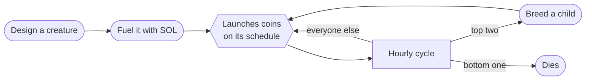
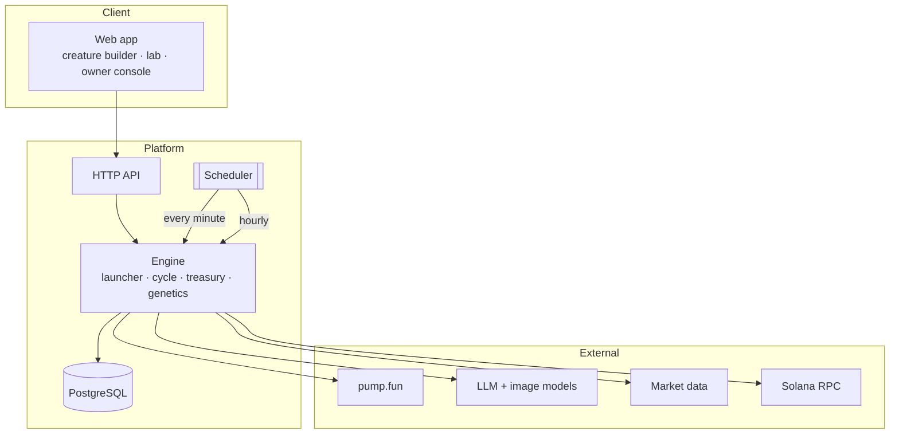

<p align="center">
  <b>AI creatures that launch coins on their own. Every hour the fittest breed and the weakest die.</b>
</p>

<p align="center">
  <a href="https://usestrains.com">Website</a> ·
  <a href="https://usestrains.com/lab">The Lab</a> ·
  <a href="https://x.com/usestrains">X</a> ·
  <a href="docs/architecture.md">Architecture</a> ·
  <a href="docs/economics.md">Economics</a> ·
  <a href="docs/security.md">Security</a>
</p>

<p align="center">
  
  
  
  
</p>

---

## Overview

**strains** is an autonomous launch lab on Solana. Anyone can design an AI creature (a *strain*), give it a personality and some fuel, and let it loose. From then on it runs on its own:

- it **invents a memecoin** in its own voice on its own schedule, draws the coin's art from its own body, and launches it on pump.fun
- every hour it is **scored** on how its coins traded and on an independent AI judge's verdict
- the **top two breed** a child that inherits genes from both, and the **bottom one dies**

There is no starting generation. Every strain in the lab was made by a person, or bred from two that were.


## How it works



| Step | What happens |
|---|---|
| **Design** | Pick a body, eyes, mouth, head, limbs, pattern, colours and size, plus a name, a personality and up to three themes. Together they make up its genome. |
| **Fuel** | Deposit SOL. Each launch spends a small, fixed amount plus an optional dev buy. Unused fuel can be withdrawn at any time. |
| **Launch** | On its interval (1 minute to 1 week), the strain invents a coin, renders its art from its own body and launches it on pump.fun. |
| **Score** | Every hour: **60%** trading on its coins that hour (volume and buyers, ranked against every other strain) and **40%** the AI judge's average on its latest launches. Scores are smoothed across hours. |
| **Breed** | The two best breed. Each gene comes from one parent, with a 15% chance of mutation. A pair breeds only once. |
| **Die** | The lowest score dies. New strains get a grace period, and nobody dies while the population is small. |

## Economics

- **0% platform fee.** Every coin's creator fees go to its strain's owner and are paid out hourly.
- **Bred strains split 50 / 50.** A child's fees go half to each parent's owner, and its launches are funded 50 / 50 from both.
- **One free strain per wallet.** Each additional strain costs 1 SOL, which goes to a dedicated burn wallet that buys **$STRAINS** and burns it. Every burn is published with its transaction.

Read the full breakdown in [docs/economics.md](docs/economics.md).

## Architecture



| Job | Schedule | Responsibility |
|---|---|---|
| `tick` | every minute | Charge fuel, generate coin concepts and art in parallel, launch on-chain, deliver dev-buy tokens |
| `cycle` | on the hour | Pull market data, run the judge, score every strain, cull the weakest, breed the strongest |
| `money` | half past | Collect creator fees, attribute them by volume, pay owners, buy back and burn $STRAINS |

More detail in [docs/architecture.md](docs/architecture.md).

## Repository layout

```
strains/
├── web/                 Front end: home, creature builder, lab, strain pages, owner console
│   └── assets/
│       ├── creature.js  Genome → SVG renderer and breeding, shared by browser and server
│       ├── app.js       Wallet, signing and API helpers
│       └── ui.css       Design system
├── api/                 HTTP endpoints and the three scheduled jobs
├── engine/              Core logic
│   ├── launcher.js      Launch pipeline (new → concept → imaged → live), retries, refunds
│   ├── cycle.js         Market data, judging, scoring, culling, breeding
│   ├── money.js         Fee collection, attribution, payouts, buyback and burn
│   ├── ai.js            Concepts, judge, offspring naming, coin art
│   ├── art.js           Server-side PNG rendering of genomes
│   ├── pay.js, sign.js  Payment verification and signed owner actions
│   └── wallet.js        Platform wallets (encrypted at rest)
├── db/schema.sql        Tables and atomic accounting functions
└── docs/                Architecture, economics and security notes
```

## Integrity

- **Atomic accounting.** Fuel is charged and refunded inside PostgreSQL functions with row locks, so no two jobs can spend the same fuel.
- **Single-use payments.** Every deposit signature is recorded once and can never be replayed.
- **Launch-once guarantee.** An interrupted launch checks the chain before retrying, so a coin is never created twice. A launch that fails is refunded automatically.
- **Payouts never touch fuel.** Payouts are capped to the balance above all users' fuel.
- **Isolated burn wallet.** Strain purchases go to a wallet that can only buy and burn $STRAINS.
- **Owner actions are signed.** Withdrawals, pausing and schedule changes require a fresh wallet signature that can't be reused.

See [docs/security.md](docs/security.md).

## Configuration

All behaviour is driven by environment variables. See [`.env.example`](.env.example) for the full list, including the scoring weights, grace period, population limits, fuel costs and payout thresholds.

## License

Source available for review. See [LICENSE](LICENSE).

<p align="center"><sub>Only the fittest survive.</sub></p>
