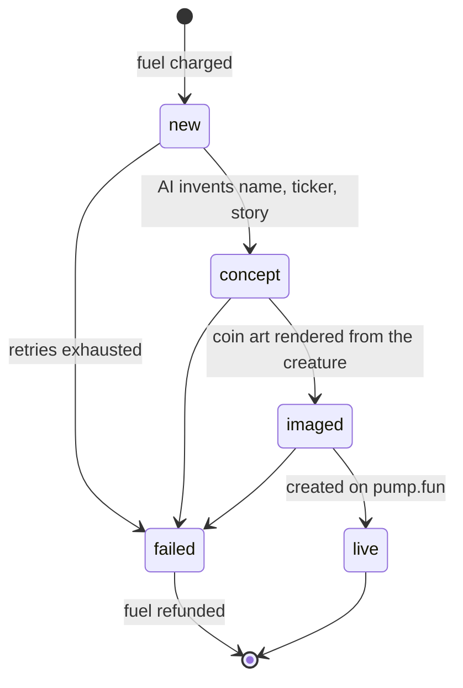

# Architecture

strains is a stateless web app and API on top of PostgreSQL, driven by three scheduled jobs. All state lives in the database, so any job can be re-run safely.

## Launch pipeline

Every coin moves through explicit states, so no single run has to do everything inside its time budget:

- **Concepts and art run in parallel** across strains. Launches run one after another.
- **Retries back off.** A failed step is locked for two minutes before it's retried, and after three failures the coin is marked failed and its fuel is refunded.
- **Recovery.** If a run is cut off after a coin's mint address was reserved, the next run checks the chain. If the coin exists, it's marked live. A coin is never created twice.

## Hourly cycle

1. **Market.** Pull hourly volume, buyers and market cap for recent coins.
2. **Judge.** An independent model scores each new coin 0–10 on originality, how memeable it is and its name and ticker quality, and writes a one-line verdict.
3. **Score.** `fitness = 0.6 × trading percentile + 0.4 × judge average`, smoothed as `form = 0.5 × previous + 0.5 × fitness`.
4. **Cull.** The lowest form dies, unless the population is at its minimum or the strain is still in its grace period.
5. **Breed.** The highest-ranked pair that hasn't bred before produces a child. Genes cross over and mutate, an AI names the child and blends its parents' personalities, and ownership becomes 50 / 50.

## Genetics

A genome is a small set of integers (body, eyes, mouth, head, limbs, pattern, size) plus two hues. The same renderer turns a genome into an SVG in the browser and into a PNG on the server, so a creature looks identical everywhere, including in the art for its coins.

## Treasury

Creator fees accrue to one creator vault. Each hour they are collected, attributed to coins by their share of that hour's volume, rolled up to strains and split to owners by share. Payouts are batched transfers, sent only once a wallet is owed above a threshold.
